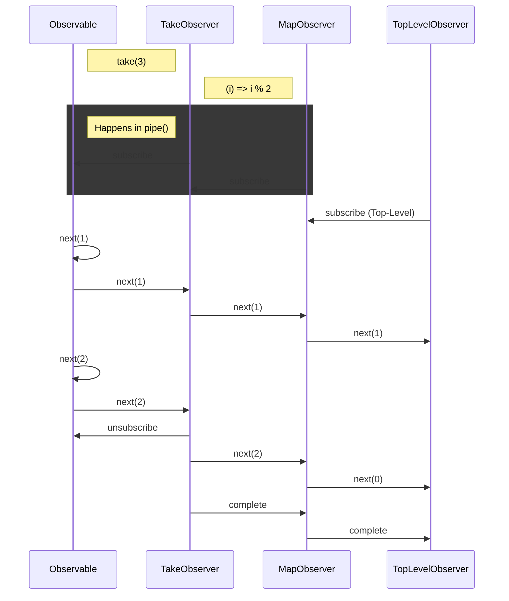

What happens when we do user->>obs: pipe(take(2), map(() => n % 2))

```mermaid
    sequenceDiagram
    participant obs as Observable
    participant TakeObserver as TakeObserver
    participant MapObserver as MapObserver
    participant tlo as TopLevelObserver
    note left of TakeObserver : take(3)
    note left of MapObserver : (i) => i % 2
    
    rect rgb(56, 56, 56)
    note right of obs : Happens in pipe()
        TakeObserver->>obs: subscribe
        MapObserver->>TakeObserver: subscribe
    end
    tlo->>MapObserver: subscribe (Top-Level)
   
    obs->>obs: next(1)
    obs->>TakeObserver: next(1)
    TakeObserver->>MapObserver: next(1)
    MapObserver->>tlo: next(1)

    obs->>obs: next(2)
    obs->>TakeObserver: next(2)
    TakeObserver->>obs: unsubscribe
    TakeObserver->>MapObserver: next(2)
    MapObserver->>tlo: next(0)

    TakeObserver->>MapObserver: complete
    MapObserver->>tlo: complete
```