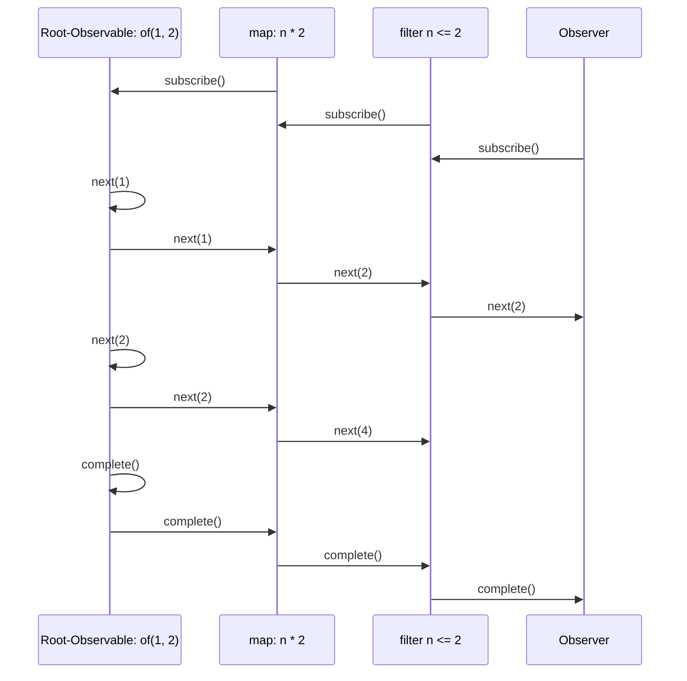

# Introduction
Within the last few years Reactive Programming bacame a core tool which is used by a lot of programmers in their day-to-day work. Reactive Programming is specified in the ReactiveX (Reactive E**X**tensions) API  which provide a solution for "asynchronous programming with observable streams". There are other specifications but they are not part of this article.  

One of the most notable frameworks which uses an implementation of ReactiveX is Angular. Angular includes the RxJS library as a direct dependency and uses it for implementing a reactive and standardized solution for working with data streams and data manipulation.
Altough RxJS is widely used by developers and adopted by major frameworks, it is often hard for new developers to understand it. Furthermore there are many common pitfalls which make working with it not so intiuitive.

I remember having  a hard time getting into RxJS. This article tries to ease new developers into ReactiveX and RxJS and also gives some insights for handling the more complex topics like Higher-Order Observables and the inner workings of RxJS.  
Within the article I will show all examples with TypeScript and the RxJS Library, as I am most comfortable with those implementations. Nevertheless the concept here will apply to all implementations of ReactiveX.

## Why Reactive Programming?
Reactive Programming streamlines the handling of data which change (asynchronousely) over time by providing an uniform interface for it. 
It is most helpful for data events which are generated interactively or is provided by an external data source to your application.   

A few good examples for using RxJS are:
* User-Input (Touch, Mouse, Keyboard)
* Data beeing pushed to the App (WebSockets)
* Frequent state changes over time (Redux comes to mind)

### But there are Nested-Callbacks, Promises, EventListeners!
Yes, there are, and they are a valid way to solve your problems and they each have their own advantages. But when they are mixed in an (frontend) application they define a non-uniform interface with different capabilities for handling data:   
* **Simple callbacks**  
  Can be used as an easy way to emit data events, but there is no error or completion event handling built-in. So you often need to provide multiple callbacks for each event type (next, complete, error). Also unsubscribing of nested callbacks need to be done manually.  
  E.g: Hooks / Template Methods
* **Promises**  
  When you only need one single data event with error and completion event handling, promises are the way to go.  
  They also provide a more streamlined API for automatic "subscription" handling.
  E.g: REST-Requests
* **EventListeners**  
  When you want to have indefinite number of data events but error handling is not relevant,  EventListeners are sutiable for that  
  E.g.: Key-Up events on Input Field

Contrasting the exapmles above, ReactiveX uses **Observables** which provide a generic solution with a lot more flexibility for handling the type and number events which are emitted by your source.  

Of course, using it, will add an additional abstraction layer inside your application, which adds a bit of complexity to it.  
Furthermore, it will add an additional dependency, which needs to be kept up to date and developers need to be able to understand it.

As you can see in this table, the use of Observables provide *one* solution for all desirable capabilities.
| Technology | Synchronous | Asynchronous | Multiple events | Complete event | Error event |
|-------- | -------- | -------- | -------- | -------- | -------- |
| Callback | ✅ | ✅ | ❌ | ❌ | ❌ |
| Promise | ❌ | ✅ | ❌ | ✅ | ✅ |
| EventListener | ✅ | ❌ | ✅ | ❌ | ❌ |
| Observables | ✅ | ✅ | ✅ | ✅ | ✅ |


## Core concepts of ReactiveX
To understand how we work with **Observables** we need to understand a few key elements of the API:  
* You *subscribe* to **Observables** and react to *one or multiple values* which are returned over time  
* After all values are returned, your **Observer** gets informed in a **complete** event
* If an Error occured the **Observer** also get noticed and receives an **error** event
* When we can daisy-chain **Observers** together by using **Pipes**

In the list above we can see a few keywords which are part of the terminology used by Reactive Programming.  
The differences are described further below.

### Observable
  Defines a source of data which can be observed.  
  Imagine fetching data with a simple GET HTTP-Request.  
  It will emits 3 different event types to which you can subscribe:
  * **next**  
    Is triggered when the next data point is returned in the stream  
    → Payload of the REST-Response
  * **complete**  
    Is triggered when it completes and contains **no data**  
    → REST-Request completed (after the **next**)
  * **error**  
    Is triggered when an exception got thrown and contains the error  
    → 404 Response from Server

 #### Examples of event types beeing triggered
 Here are some examples of use cases which are triggering the different event type callback of an observable. 
| Example | Next trigger count | Complete  trigger | Error  trigger | 
|-------- | -------- | -------- | -------- |
| GET Request (success) | 1 | ✅ | ❌ |
| DELETE Request (success) | 0 | ✅ | ❌ |
| POST Request (error) | 0 | 0 | ✅ |
| WebSockets (still open) | 0 ... n | ❔ | ❔ |
| User-Input in Textbox (still open)* | 0 ... n | ❌ | ❌ |

*The dom subscriptions of inputs normally do not complete or error


#### Examples of Observables
RxJS provides a lot of handy creation functions for instantiating Observables.  
Examples:  
```ts
// Creates an Observable which will trigger events when the keyup event is fired on an input element
const inputKeyupObservable = fromEvent(htmlInput, 'keyup');

// Will emit values 1 and 2 and then completes right away
const value1and2Observable = of(1,2);

// Will emit a tick all 500ms
const all500msTick =  timer(500);

// Note: Those Observables will only do something, when you subscribe to it (see next section)
```

### Observer / Subscriber
This is the part of the app which is interested in the events. Normally this is your app receiving the data and then doing something with it.  
In the case of the frontend this could be the changes in an input-field which is triggered by the user typing. You could then use this data to trigger autocompletion or form validation.  
We subscribe to an *Observable* by providing an **Observer** / **Subscriber**. It has one or only some of the callbacks defined for the event types described in the Observable section.  
Event callback types: `next()`, `error()`, `complete()`

After the `subscribe()` was called on the *Observable* we get a **Subscription** back which is used to unsubscribe when we are no longer interested in the events.

#### Example of an Observer
```ts
// Normally, this is inlined in the subscribe() call below
const myUserInputObserver = {
  next: (myValue: string) => {doAutocomplete(myValue)},
  error: (error) => { console.log(error); },
  complete: (complETE) => { console.log(complete); }
};

const inputKeyupObservable = fromEvent(htmlInput, 'keyup');
const mySubscription = inputKeyupObservable.subscribe(myUserInputObserver);
```

### Subscription
The subscription is used to unsubscribe after we are no longer interested in the events emitted by the Observable. This is normally the case, when a component is unloaded or we want to abort an ongoing data-fetch process. 
(When we use the built-in RxJS-methods this is normally handled by the librarry).


#### Exapmle of a Subscription 
After our component got destroyed we want to make sure we do not keep listening to events which are triggered by the Observable. If we forget to do that, there could be some nasty side-effects with bugs which are tough to track down.*  
```ts
class MyComponent {
  private mySubscription?: Subscription;

  public onInit(): void {
    // {...}
    this.mySubscription = inputKeyupObservable.subscribe(myUserInputObserver);
  }

  // {...}
  public onDestroy(): void {
    this.mySubscription?.unsubscribe();
  }
}
```
*Some frameworks (like Angular 16) provide Observables instead of LifeCycle-Hooks to for cleanup.  
Angular 16 Example:  
```ts
// Example taken from: https://indepth.dev/posts/1518/takeuntildestroy-in-angular-v16
import { takeUntilDestroyed } from '@angular/core/rxjs-interop';

export class MyComponent implements OnInit{
  myData: Data;

  constructor(private service: DataService) {
    this.service.getData()
      // Will call unusbscribe() automatically,  
      // when the takeUntilDestroyed() gets triggered
      .pipe(takeUntilDestroyed())
      .subscribe(data => this.data = data)
  }
}
```

### Pipes
A Pipe is used to connect 2 observables together. You can chain multiple observables together which results in the data stream beeing processed by one observable after another. In RxJS there are a lot of useful *operator* functions. They make it easier for you to work with the data events beeing emitted by the *root* observable.

#### Example of using pipes
As you can see below, pipes are a handy way to setup the plumbing of your Observables. When you use the built-in *operator* functions you can easily manipulate and filter the data of your event stream.
```ts
// {...}
inputKeyupObservable
.pipe(
  // Only trigger down-stream observer at most all 200ms 
  debounceTime(200),
  // Remove leading and trailing whitespaces
  map((value) => value.trim()),
  // We are only interested in values which are longer than 3 chars in order to return a meaningful subset
  filter((value) => value.length >= 3),
  // We are only interested in values which changed between the current and next event
  distinctUntilChanged()
)
.subscribe({
  next: (searchValue) => suggestAutocomplete(value)
});
```

I will go into more detail about how Pipes work in the background in a later section. But for now imagine all *operator* functions above create new **Observables** which subscribe to the upstream **Observables**. They perform some calculation, filtering or fetching of data and return the result to the next downstream **Observer**.  
* You *subscribe* to the *Upstream-Observable*.  
  -> Dependency direction
* You *emit* to the *Downstream-Observable*.  
  -> Data flow direction

Example:
```ts
of(1, 2)
  .pipe(
      tap((n) => console.log("Root: " + n)),
      map((n) => n * 2),
      filter((n) => n <= 2)
  ).subscribe({
      next: (n) => console.log("next(), got: " + n),
      error: (e) => console.log("error(), got: " + e),
      complete: () => console.log("complete()")
  });
/* Output:
Root: 1
next(), got: 2
Root: 2
complete()
*/
```



### Subjects
When building your own data streams the use of Subjects provide you with an easy way to create *an Observable to which you can push data to*. So instead of defining all the events triggered within an Observable, the Subject provides additional functions to do so.

#### Subject
When using a simple **Subject** you are more interested in the events and less in the current state of your data.
For example, you could use a Subject to emit WebSocket events returned from your server, like so:  
```ts
interface ApiStatus {
    type: "ApiStatus"
    status: string;
}

const websocketEventSubject = new Subject<ApiStatus>();

var subscription = websocketEventSubject.subscribe({
    next: (event: ApiStatus) => console.log(`Next ${event.type}`),
    complete: () => console.log("Complete"),
    error: () => console.log("Exit"),
});

websocketEventSubject.next({type: "ApiStatus", status: "OK"});
websocketEventSubject.complete();

/* Output:
Next ApiStatus
Complete
*/
```

#### BehaviorSubject
Pretty fast you want to be able to know the latest value of the data stream which was emitted. With the help of the *BehaviorSubject* you can do that by calling `value()` on it. It will also immediatly return the latest stored value when you subscribe to it.  
A good example would be the User Login status.

```ts
// NOTE: You need an initial value, but you could also define <boolean | undefined> as type if you do not know at instantiation time.
const userLoggedInSubject = new BehaviorSubject<boolean>(false);

userLoggedInSubject.pipe(
    // Ensure we only emit values, when they changed
    distinctUntilChanged()
).subscribe({
    next: (event: boolean) => console.log(`Is Logged In: ${event}`),
});
// As you will see it will log the initial  / current value immediately, the first subscription
console.log("userLoggedInSubject did subscribe");


// Gets filtered out by distinctUntilChanged
userLoggedInSubject.next(false);
userLoggedInSubject.next(true);

console.log("Outside state: " + userLoggedInSubject.getValue());

/*
  Output:
Is Logged In: false
userLoggedInSubject did subscribe
Is Logged In: true
Outside state: true
*/
```

#### ReplaySubject
When we are interested in all events emitted by the Subject you can use the ReplaySubject. It is especially handy to track changes over time. For example you could define a *ReplaySubject* to have the possibility to replay state changes over time, like Redux. Or you could apply the concept of event sourcing to your state.
Example:
```ts
interface State {
    name: string;
    firstName: string;
    email: string;
}

const myEventSourcingDB = new ReplaySubject<Partial<State>>();
console.log("Before myStateStore was subscribed to");
myEventSourcingDB.next({name: "Peter"});
myEventSourcingDB.next({firstName: "Parker"});
myEventSourcingDB.next({email: "tony-stark@example.com"});

myEventSourcingDB.pipe(
    scan((partialState, newPartialState) => {q 
      return {...partialState, ...newPartialState}})
).subscribe({
    next: (state: Partial<State>) => console.log(`Accumulated state: ${JSON.stringify(state)}`),
});

// As you will see it will aready have logged all changes.
console.log("After myEventSourcingDB did subscribe");

/* Output:
Before myStateStore was subscribed to
Accumulated state: {"name":"Peter"}
Accumulated state: {"name":"Peter","firstName":"Parker"}
Accumulated state: {"name":"Peter","firstName":"Parker","email":"tony-stark@example.com"}
After myEventSourcingDB did subscribe
*/
```

#### AsyncSubject
This Subject will only return the last value it had in it's pipe when it completes. This Subject is not that helpful, as you can just use the operator function `last()` within a normal subject to achieve this.  
For example:
```ts

const dragAndDropValue = new AsyncSubject<string>();
dragAndDropValue.next("List item 1");
dragAndDropValue.next("List item 2");

dragAndDropValue.subscribe({
    next: (value: string) => console.log(`Latest value: ${value}`),
    complete: () => console.log("Complete"),
    error: () => console.log("Exit"),
});
console.log("After subscribe");
dragAndDropValue.next("List item 5");

dragAndDropValue.complete();
console.log("After complete");

/* Output:
After subscribe
Latest value: List item 5
Complete
After complete
*/
```


### Helper / Operator Functions of RxJS
RxJS helps you a lot with built-in functions for setting up your data streams. The functions can be split into the following categories.
* Creational
* Filtering
* Mapping
* Analytical


## Marble diagrams
When working with RxJS the use of marble diagrams help you design your observables in the right way.  
They show the Observable and the data returned by it over time.  
Here you can see an Observable which returns the values "A", "B", "C" over time and then completes. (Denoted by the pipe "|")  
```
--A--B--C-|-->
```

When an error occurs it is denoted by "X":  
```
--A--X-->
```

When its a stream is not terminated, there is no "X" and no "|":  
```
--A--B--C-->
```


In on itself this is not very helpful, but if you combine observables by filtering and and mapping it,  
it is a lot clearer of what is happening.  
```
--1--2--3--4--5-->        # An Observeble which returns a stream of integers
  [map: n => n * 2]       # Map-Operator
--2--4--6--8--10->        # New Observable
  [filter: n => n > 2]    # Filter-Operator
-----4--6--8--10->        # Final Observable
```

### Marble diagram resources
There are interactive Marble diagrams to help explain developers what is happening.
* **[Rx-Marbles](https://rxmarbles.com/#filter)**  
  Defines interactive marble diagrams
*  **[Rx-Visuzalize](https://rxjs-visualize.explosionpills.com/,sample)**  
  Visualizes events my animating them over time


# Getting technical
Now we've had a brief overview over ReactiveX and RxJS let's dive deeper into the workings within the RxJS library.

## Our very own Observable
In the examples in the Introduction we saw *creation* functions like `of(1,2)` or `fromEvent(input, 'keyup')`. In 90% of the cases those *creation* functions serve your needs and you do not need to create Observeables yourself.  
But we want to understand how you can create our own so we get a deeper understanding of the inner workings of RxJS.

When defining a custom observable, the basic structure reminds us a lot of Promises.  
Recalling promises, we have two callback methods beeing passed to the "on-subscribe" method. We then use either one or the other to *fulfill* or *reject* the promise.
```ts
// Note: We need to give back all the values at once, as we only trigger resolve once!
let myPromise = new Promise<number[]>((resolveCallback, rejectCallback) => {
  resolveCallback([1,2,3]);
});
```

### Example of custom Observable
If we look at the Observable we can see that, similarily to the Promise, we pass-in an observer which contains the three callback methods `next()`, `complete()` and `error()`.
```ts
var oneToThree = new Observable<number>((subscriber) => {
    for (var i = 1; i <= 3; i++) {
        subscriber.next(i);

    }
    subscriber.complete();

    // Will be ignored by subscriber, as we already closed the stream with complete()
    subscriber.next(42);
    // Will be ignored by subscriber, as we already closed the stream with complete()
    subscriber.error("some error");

    // Is triggered after subscriber.complete() or subscriber.error() was executed or unsubscribe() was called
    return () => {
        console.log("Cleanup resources, used by this Observable")
    };
});
```

So the key points are:  
* We pass in the subscriber which contains the callbacks `next()`, `complete()` and `error()`
  * We call one, some or none of the passed-in callbacks  
* We return a method which contains *tear-down logic*, which is triggered after the observable stream closed.
  * E.g.: Close Websockets, Unsubscribe EventListener from Inputs
* The first time calling either `complete()` or `error()` will result in all future callbacks to be ignored


## Higher-Order Observables
There is only a small difference between normal Observables and High-Order Observables. While "normal" Observables are handling simple values in their data stream - like numbers, arrays or objects - Higher-Order Observables are handling Observables themselfs.

Here is an exmple of the differences between those two:
```ts
// Returns Place[] within next()
let normalObs: Observable<Place[]>;

// Returns Observable<Place[]> within next()
let highLevelObs: Observable<Observable<Place[]>>;
```

A fair question is, why is this necessary?  
To answer this we need to look into the conditions and the exact timing when we generate an observable. Let's look again at the autoComplete example. There we want to fetch suggested places from the server when the user is typing.  
So to start your pipe you would listen to `fromEvent(inputElement, 'change')` which will provide you with a stream of strings: `Observable<string>`    
Based on the events triggerd by this Observable you would want to fetch the data from a server, for which you can use `ajax("api\places?q=" + query)`, which also returns an observable `Observable<string[]>`.

So, in the end you map the `string` values to `Observable<string[]>`. That means your Outer Observable now is of type `Observable<Observable<string>`.

**Let's piece the example together in code**
```ts
// NOTE: This is just for learning purpose, there are better approaches (see next Section)
let ongoingRequestSubscription: Subscription;

// Type is:                 Observable<Observable<string[]>>
const highLevelObservable = fromEvent(inputElement, 'change').pipe(
    // Type is:            Observable<string[]>
    map((value: string) => ajax.getJSON(`api/places?q=${value}`))
);

highLevelObservable.subscribe({
  next: (fetchObs: Observable<string[]>) => {
      // Cancel open request
      ongoingRequestSubscription?.unsubscribe();

      ongoingRequestSubscription = fetchObs.subscribe({
        next: (places: string[]) => {
          showSuggestions(places):
        }
    });
});
```
This looks cumbersome, because it is. There is a lot of boilerplate code to get this running. There is a much easier way to achieve this which also manages the `ongoingRequestSubscription` for us. (See: Common High-Order operator functions)

### Inner and Outer Observables
Comming back to the example above, we can see the distinction between the **Inner Observable** and **Outer Observable**:
* Outer Observable: **`Observable<`**`Observable<MyType>`**`>`**
  * Has a stream which returns Observables
  * The stream of observables has to be subscribed and unsubscribed to (somebody needs to handle this)
* Inner Observable: **`Observable<MyType>`**
  * Has a stream of the "standard" values
  * Normally we are only interested in those "normal" values

### Common High-Order operator functions
The first touch-points a new developer has with higher-Order observables are normally the built in operator functions like `switchMap()`, `exhaustMap()` or `mergeMap()` or `concatMap()`. They are normally used to trigger a side effect or fetching of data based on an event emitted on the upstream observable.  

They take in a value and **map** it to a **new Observable** which returns another value.

Imagine for example you want to fetch suggestions for your autocomplete feature from the, when the user is typing in some letters into an input.

Lets take the example from the previous Article section about **Pipes**.  
Below you can see the code again from the section:
```ts
const mySubscription = fromEvent(htmlInput, 'keyup')
.pipe(
  // Only trigger down-stream observer all 200ms
  debounceTime(200),
  // Remove leading and trailing whitespaces
  map((value) => value.trim()),
  // We are only interested in values which are longer than 3 chars in order to return a meaningful subset
  filter((value) => value.length >= 3),
  // We ar only interested in values which changed between the current and next event
  distinctUntilChanged()
)
.subscribe({
  next: (searchValue) => suggestAutocomplete(value)
});
```

Here, we first ensure we trigger our `next()` callback only, after we debounced and filtered for the relevant data.  

Then we trigger the display of the autocomplete by triggering `suggestAutocomplete(value)`. This solution is fine, as long as the search for the suggestable items is fast and done locally, without requesting a result set from a server.   
But, normally we do want to query such data from a server. When we do that the time to fulfill the "find suggestions" can vary greatly, so a request sended earlier could be returned after the second one. Reasons for the delay could be simply the network, busy server resources.  

So we should expect, that multiple requests are sent to the server which are overlapping each other:
```ts
// Our pipeline gets triggered by these two values in the next(), within 200ms
=time=>
--Ber---------------------Berge-->
   ╎                      ╎
   GET /api/place?q=Ber------------------------------------AnswerA-|->// Late answer, because slow network
                          ╎                                ╎
                          GET /api/place?q=Berge---AnswerB-╎-|-> 
                                                   ╎       ╎
[Subscriber]---------------------------------------AnswerB-AnswerB-->                                                           
```

As you can see this can result in the suggestions beeing overwritten by the old Answer, if we are not careful.
To solve this problem we would make sure to first **cancel** the old request before sending the new one. This is a very common problem and can easily be dealt with, with RxJS.  

It can be done the following way:
```ts
const mySubscription = fromEvent(htmlInput, 'keyup')
.pipe(
  // {...}
  // New code, will map the current inputValues to a new Observable which returns the search results
  switchMap((value: string) => {
    return fromFetch(`https://my-api.com/api/place?q=${query}`);
  })
)
.subscribe({
  // We now only need to display the suggestions
  next: (values: string[]) => showSuggestions(values)
});
```

What happens with switchMap is the following:
* When no GET Request is on the way, it just creates a new one as **Inner Observable** and subscribes to it (`fetchFrom()`)
* When a value is returned from the GET, return it to the **Outer Observable** (Our top level subscriber)
* When a GET request is already on the way, cancel it and unsubscribe from the **Inner Observable**, create a new one (see first bullet point)

An additional advantage is, that calling `mySubscription.unsubscribe()` will automatically unsubscribe to all inner and outer **Observable**. So yo do not need to handle any resource management yourself. 
```ts
// Our pipeline gets triggered by these two values in the next(), within 200ms
=time=>
--Ber---------------------Berge-->
   ╎                      ╎
[switchMap]---------------[switch]--->
   ╎                      ╎  ╎
subscribe       unsubscribe  subscribe        
   ╎                      ╎  ╎
   GET /api/place?q=Ber---X  ╎
                             ╎
                             GET /api/place?q=Berge---AnswerB-|->
                                                      ╎
[Subscriber]------------------------------------------AnswerB--> 
                                                          
```

### Difference between switchMap, exhaustMap, mergeMap

The main difference between the operators is, when the unsubscribe and subscribe to the new Observables generated by the functions passed into them.

#### switchMap
In the example above we saw the usage of **switchMap** to *switch* to a new Observable when we receive a new value, the subscription to the previous Observable is dropped by an `unsubscribe()` and it calls the `subscribe()` on the new one.

**`switchMap()` behaviour**
* Current **Inner Observable**:
  * Unsubscribe, if exists
* New **Inner Observable**:
  * Subscribe right away

```ts
const inputTrigger = obsInput200MsValues(); // Returns "Ber", "Berge", "Bregenz" after 200ms each
const subscription = inputTrigger.pipe(
    switchMap((value) => requestWhichTakes220Ms(value))
).subscribe({
    next: (value) => console.log(`Next: ` + value)
});

/* Output:
Next: Bregenz
*/
```

#### exhaustMap
With `exhaustMap()` your code will always complete the currently open **Inner Observable** before subscribing to the next one. 
It also only remembers the latest **Inner Observable**, which was returned by the method provided to `exhaustMap()`.

**`exhaustMap()` behaviour**
* Current **Inner Observable**:
  * Wait for value(s) and completion
* New **Inner Observable**:
  * Remember Observable for after the current one completed
  * Subscribe, after current one completed or there is no current one

```ts
const inputTrigger = obsInput200MsValues(); // Returns "Ber", "Berge", "Bregenz" after 200ms each
const subscription = inputTrigger.pipe(
    exhaustMap((value) => requestWhichTakes220Ms(value))
).subscribe({
    next: (value) => console.log(`Next: ` + value)
});
/* Output:
Next: Ber
Next: Bregenz
*/
```

#### mergeMap
With `mergeMap()` will just subscribe to all new **Inner Observable** right away and return the balues concurrently in the next event callback.

**`mergeMap()` behaviour**
* Current **Inner Observable**:
  * Wait for values and completion
* New **Inner Observable**:
  * Subscribe right away
  * Return events to the **Outer Observable** as soon as they arrive

```ts
const inputTrigger = obsInput200MsValues(); // Returns "Ber", "Berge", "Bregenz" after 200ms each
const subscription = inputTrigger.pipe(
    mergeMap((value) => requestWhichTakes220Ms(value))
).subscribe({
    next: (value) => console.log(`Next: ` + value)
});
/*
  // Note: The order is not guaranteed, depending on the speed of the requests it could all be jumbled up
  Output:
Next: Ber
Next: Berge
Next: Bregenz
*/
```

#### concatMap
With `concatMap()` queues all new  **Inner Observables** and completes one after another. When the current one is completed the next in the queue is executed.

**`concatMap()` behaviour**
* Current **Inner Observable**:
  * Wait for values and completion
* New **Inner Observable**:
  * Add it to the queue
  * Subscribe to it, when the previous observables finished

```ts
const inputTrigger = obsInput200MsValues(); // Returns "Ber", "Berge", "Bregenz" after 200ms each
const subscription = inputTrigger.pipe(
    concatMap((value) => requestWhichTakes220Ms(value))
).subscribe({
    next: (value) => console.log(`Next: ` + value)
});
/*
  // Note: Here the order is guaranteed, as concatMap always waits on the completion of the previous Inner Observable
  Output:
Next: Ber
Next: Berge
Next: Bregenz
*/
```

## Hot vs Cold Observable
// TODO: Add content / examples and so on.

## Scheduling
Scheduling is a topic which needs a bit of background knowledge of how Browser and JavaScript Engines work. Depending on which type of scheduler you use there might be some nasty side effects and hard issues to debug. Which scheduler is implicitly used is not alway clear. This section tries to explain the differences between them and which of the most common RxJS functions result in which scheduler usage.

See: [Learn RxJs - Schedulers](https://rxjs.dev/guide/scheduler)

Normally you do not need to change the schedulers, but be aware, that there are 2 general groups:
**Synchronous**
* `next()` gets called immediately
* Exmamples:
  * of(), fromArray()
  * empty(), range()
  
**Asynchronous**
* `next()` gets called when the next setTimeout animationFrame, process.nextTick is triggeret
* Examples:
  * interval(), timer(), delay()
  * bufferTime(), delay(), debounce()
  * fromEvent(), ajax()


### 