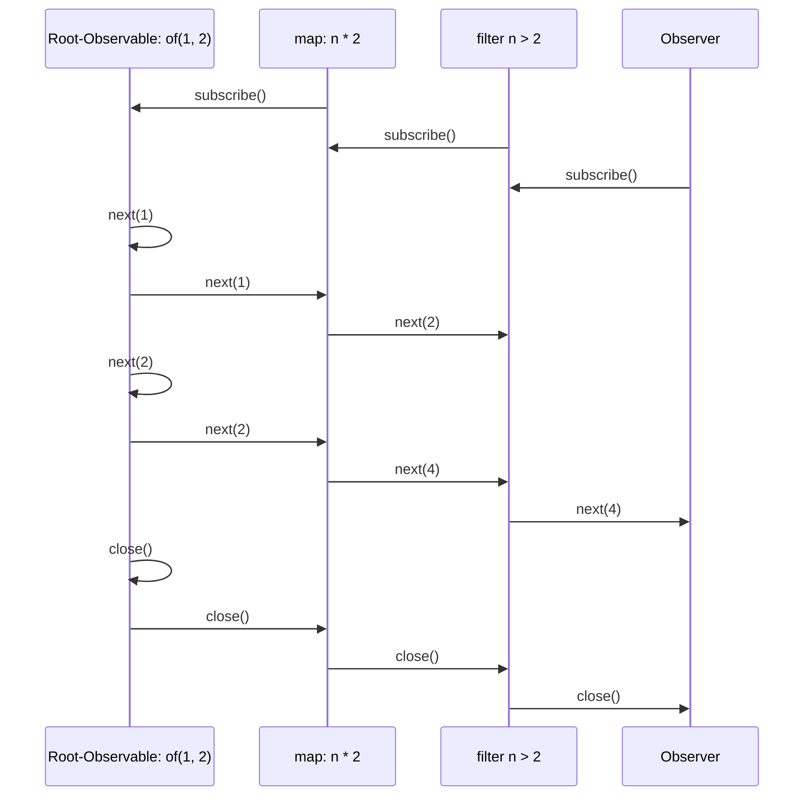

# Introduction
Within the last few years Reactive Programming bacame a core tool which is used by a lot of programmers in their day-to-day work. Reactive Programming is specified in the ReactiveX (Reactive E**X**tensions) API  which provide a solution for "asynchronous programming with observable streams". There are other specifications but they are not directly part of this article.  

One of the most notable frameworks which uses an implementation of ReactiveX is Angular. Angular includes the RxJS library as a direct dependency and uses it for implementing a reactive and standardized solution for working with data streams and data manipulation.
Altough RxJS is widely used by developers and adopted by major frameworks, it is often hard for new developers to understand it. Furthermore there are many common pitfalls which make finding problems hard.

I remember having  a hard time getting into RxJS. This article tries to ease new developers into ReactiveX and RxJS and also gives some insights for handling the more complex topics like Higher-Level Observables and the inner workings of RxJS.  
Within the article I will show all examples with TypeScript and the RxJS Library, as I am most comfortable with those implementations. Nevertheless the concept here will apply to all implementations of ReactiveX.

## Why Reactive Programming?
Reactive Programming streamlines the handling of data which change (asynchronousely) over time by providing an uniform interface for it. 
It is most helpful for data events which are generated interactively or is provided by an external data source to your Application.   

For Example:
* User-Input (Touch, Mouse, Keyboard)
* Data beeing pushed to the App (WebSockets)
* State which changes over time (Similar to "Redux")

### But there are Nested-Callbacks, Promises, EventListeners!
Yes, there are, and they are a valid way to solve your problems and have their own advantages. But when they are mixed in an (frontend) application they define a non-uniform interface with different capabilities for handling data:   
* **Simple callbacks**  
  Can be used as an easy way to emit a data events, but there is no error or completion event handling built-in. So you often need to provide multiple callbacks for each event type.  
  E.g: Hooks / Template Methods
* **Promises**  
  When you only need one single data event and with error and completion event handling, Promises are the way to go  
  E.g: REST-Requests
* **EventListeners**  
  When you want to have indefinite number of data events but error handling is not relevant,  EventListeners are sutiable for that  
  E.g.: Key-Up events on Input Field

Contrasting the exapmles above, ReactiveX uses **Observables** which provide a generic solution with a lot more flexibilities for handling the type and number events which are emitted by your source.  

Of course, when you use it you will have an additional abstraction layer which you use in your application.  
This results in an additional dependency which needs to be kept uptodate and developers need to be able to understand it.

As you can see in this table the use of Observables provide *one* solution for all desirable capabilities.
| Technology | Synchronous | Asynchronous | Multiple events | Complete event | Error event |
|-------- | -------- | -------- | -------- | -------- | -------- |
| Callback | ✅ | ✅ | ❌ | ❌ | ❌ |
| Promise | ❌ | ✅ | ❌ | ✅ | ✅ |
| EventListener | ✅ | ❌ | ✅ | ❌ | ❌ |
| Observables | ✅ | ✅ | ✅ | ✅ | ✅ |


## Core concepts of ReactiveX
To understand how we work with **Observables** we need to understand a few key elements of the API:  
* You *subscribe* to **Observables** and react to *one or multiple values* which are returned over time  
* After all values are returned, your **Observer** gets informed in a **complete** event
* If an Exception happend the **Observer** also get noticed and receives an **error** event
* When we can daisy-chain the streams of **Observers** together by using **Pipes**

In the above list we can see a few keywords which are part of the terminology used by Reactive Programming.  
The differents are described further below.

### Observable
  Defines a source of data which can be observed.  
  Imagine fetching data with a simple GET HTTP-Request.  
  It will emits 3 different event types to which you can subscribe:
  * **next**  
    Is triggered when the next data point is returned in the stream  
    → Payload of the REST-Response
  * **complete**  
    Is triggered when it completes  
    → REST-Request completed
  * **error**  
    Is triggered when an exception got thrown  
    → 404 Response from Server

 #### Examples of event type callbacks
 Here are some examples of how different use cases are triggering the different event type callback of an observable. 
| Example | Next trigger count | Complete  trigger | Error  trigger | 
|-------- | -------- | -------- | -------- |
| GET Request (success) | 1 | ✅ | ❌ |
| DELETE Request (success) | 0 | ✅ | ❌ |
| POST Request (error) | 0 | 0 | ✅ |
| WebSockets (still open) | 0 ... n | ❔ | ❔ |
| User-Input in Textbox changes | 0 ... n | ❌ | ❌ |

#### Example of Observables
RxJS provides a lot of handy creation functions for instantiating Observables.  
For Example:
```ts
// Creates an Observable which will trigger events when the keyup event is fired on an input element
const inputKeyupObservable = fromEvent(htmlInput, 'keyup');

// Will emit values 1 and 2 and then completes right away
const value1and2Observable = of(1,2);

// Will emit a tick all 500ms
const all500msTick =  timer(500);

// Note: Those on itself will only do something, when you subscribe to it (see next section)
```

### Observer / Subscriber
This is the part of the app which is interested in the events. Normally this is your app receiving the data and then doing something with it.  
In the case of the frontend this could be the changes in an input-field which is triggered by the user typing. You could then use this data to trigger autocompletion or form validation.  
We subscribe to an *Observable* by providing an **Observer** / **Subscriber**. It has one or only some of callbacks defined for the event types describewd in the Observable section: `next()`, `error()`, `complete()`

After the `subscribe()` was called we get a **Subscription** back which is used to unsubscribe when we are no longer interested in the events.

#### Example of an Observer
```ts
// Normally, this is inlined in the subscribe() call below
const myUserInputObserver = {
  next: (myValue: string) => {doAutocomplete(myValue)},
  error: (error) => { console.log(error); },
  complete: (complETE) => { console.log(complete); }
};

const inputKeyupObservable = fromEvent(htmlInput, 'keyup');
const mySubscription = inputKeyupObservable.subscribe(myUserInputObserver);
```

### Subscription
The subscription is used to unsubscribe after we are no longer interested in the events emitted by the Observable. This is normally the case, when a component is unloaded or we want to abort an ongoing data-fetch process. 
(When we use the built-in RxJS-methods this is normally handled  by the librarry).


#### Exapmle of a Subscription 
After our component got destroyed we want to make sure we do not keep listening to events which are triggered by the Observable. If we forget to do that, there could be some nasty side-effects with bugs which are deviousely hard to track down.  
```ts
class MyComponent {
  private mySubscription?: Subscription;

  public onInit(): void {
    // {...}
    this.mySubscription = inputKeyupObservable.subscribe(myUserInputObserver);
  }

  // {...}
  public onDestroy(): void {
    this.mySubscription?.unsubscribe();
  }
}
```

### Pipes
Pipes are used to connect 2 observables together. You can chain observables together which results in the data stream beeing processed by one observable after another. In RxJS there are a lot of useful *operator* functions help you work with the data events beeing emitted by the *root* observable.

#### Example of using pipes
As you can see below, pipes are a handy way to setup the plumbing of your Observables. When you use the built-in *operator* functions you can easily manipulate and filter the data of your event stream.
```ts
// {...}
inputKeyupObservable
.pipe(
  // Only trigger down-stream observer all 200ms
  debounceTime(200),
  // Remove leading and trailing whitespaces
  map((value) => value.trim()),
  // We are only interested in values which are longer than 3 chars in order to return a meaningful subset
  filter((value) => value.length >= 3),
  // We ar only interested in values which changed between the current and next event
  distinctUntilChanged()
)
.subscribe({
  next: (searchValue) => suggestAutocomplete(value)
});
```

I will go into more detail about how Pipes work in the background in a later section. But for now imagine all *operator* functions above create new **Observables** which subscribe to the upstream **Observables**. They performe some calculation / filtering / feting and return the result to the next downstream **Observer**:




## Marble diagrams
When working with RxJS the use of marble diagrams help you design your observables in the right way.  
They show the Observable and the data returned by it over time.  
Here you can see an Observable which returns the values "A", "B", "C" over time and then completes. (Denoted by the pipe "|")  
```
--A--B--C-|-->
```

When an error occurs it is denoted by "X":  
```
--A--X-->
```

When its a stream is not terminated, there is no "X" and no "|":  
```
--A--B--C-->
```


In on itself this is not very helpful, but if you combine observables by filtering and and mapping it,  
it is a lot clearer of what is happening.  
```
--1--2--3--4--5-->        # An Observeble which returns a stream of integers
  [map: n => n * 2]       # Map-Operator
--2--4--6--8--10->        # New Observable
  [filter: n => n > 2]    # Filter-Operator
-----4--6--8--10->        # Final Observable
```

### Marble diagram resources
There are interactive Marble diagrams to help explain developers what is happening.
* **[Rx-Marbles](https://rxmarbles.com/#filter)**  
  Defines interactive marble diagrams
*  **[Rx-Visuzalize](https://rxjs-visualize.explosionpills.com/,sample)**  
  Visualizes events my animating them over time


# Getting technical
Now you've had a brief overview over ReactiveX and RxJS let's dive deeper into the workings within the RxJS library.

## Our very own Observable
In the examples in the Introduction we saw *creation* functions like `of(1,2)` or `fromEvent(input, 'keyup')`. In 90% of the cases those *creation* functions serve your needs and you do not need to create Observeables yourself.  
But we want to understand how you can create our own so we get a deeper understanding of the inner workings of RxJS.

When defining a custom observable, the basic structure reminds us a lot of Promises.  
Recalling promises, we have two callback methods beeing passed to the "on-subscribe" method. We then use either one or the other to *fulfill* or *reject* the promise.
```ts
// Note: We need to give back all the values at once, as we only trigger resolve once!
let myPromise = new Promise<number[]>((resolveCallback, rejectCallback) => {
  resolveCallback([1,2,3]);
});
```

### Example of custom Observable
If we look at the Observable we can see that, similarily to the Promise, we pass-in an observer which contains the three callback methods `next()`, `complete()` and `error()`.
```ts
var oneToThree = new Observable<number>((subscriber) => {
    for (var i = 1; i <= 3; i++) {
        subscriber.next(i);

    }
    subscriber.complete();

    // Will be ignored by subscriber, as we already closed the stream with complete()
    subscriber.next(42);
    // Will be ignored by subscriber, as we already closed the stream with complete()
    subscriber.error("some error");

    // Is triggered after subscriber.complete() or subscriber.error() was executed
    return () => {
        console.log("Cleanup resources, used by this Observable")
    };
});
```

So the key points are:  
* We pass in the subscriber which contains the callbacks `next()`, `complete()` and `error()`
  * We call one, some or none of the passed-in callbacks  
* We return a method which contains *tear-down logic*, which is triggered after the observable stream closed.
  * E.g.: Close Websockets, Unsubscribe EventListener from Inputs
* The first time calling either `complete()` or `error()` will result in all future callbacks to be ignored


## Higher-Level Observables
### Operator Functions
The first touch-points a new developer has with higher-level observables are normally the built in operator functions like `switchMap`, `exhaustMap` or `mergeMap`. They are normally used to trigger a side effect or fetching of data based on an event emitted on the upstream observable.  
Imagine for example you want to fetch suggestions for your autocomplete feature from the, when the user is typing in some letters into an input.

Lets take the Example from the previous Article section:
```ts
const mySubscription = fromEvent(htmlInput, 'keyup')
.pipe(
  // Only trigger down-stream observer all 200ms
  debounceTime(200),
  // Remove leading and trailing whitespaces
  map((value) => value.trim()),
  // We are only interested in values which are longer than 3 chars in order to return a meaningful subset
  filter((value) => value.length >= 3),
  // We ar only interested in values which changed between the current and next event
  distinctUntilChanged()
)
.subscribe({
  next: (searchValue) => suggestAutocomplete(value)
});
```

Here, we first ensure we trigger our `next()` callback only, after we ensured we have relevant data which and the user is not still typing.
Then we trigger the display ofthe autocomplete by triggering `suggestAutocomplete(value)`. This solution is fine, as long as we already have the possiblke suggestions loaded and do not need to fetch them from a server. 
Normally this is the case. What can happen here, is that multiple requests are sent to the server which are overlapping each other:
```ts
// Our pipeline gets triggered by these two values in the next(), within 200ms
=time=>
--Ber---------------------Berge-->
   |                      |
   GET /api/place?q=Ber------------------------------------AnswerA // Slower, because less specific query 
                          |                                |
                          GET /api/place?q=Berge---AnswerB | 
                                                   |       |
                                                   suggestion=AnswerB
                                                           |
                                                           suggestions=AnswerA
```

As you can see this can result in the suggestions beeing overwritten by the old Answer, if we are not careful.
To solve this problem we would make sure to first **cancel** the old request before sending the new one. This is a very common problem and can easily be dealt with, with RxJS.  
It can be done the following way:
```ts

const mySubscription = fromEvent(htmlInput, 'keyup')
.pipe(
  // {...}
  // New code, will map the current inputValues to a new Observable which returns the search results
  switchMap((value: string) => {
    return fromFetch(`https://my-api.com/api/place?q=${query}`);
  })
)
.subscribe({
  // We now only need to display the suggestions
  next: (values: string[]) => showSuggestions(values)
});
```

What happens now is the following:
* When no GET Request is on the way, it just creates a new one as **Inner Observable** and subscribes to it (`fetchFrom()`)
* When a value is returned from the GET, return it to the **Outer Observable** (Our top level subscriber)
* When a GET request is already on the way, cancel it and unsubscribe from the **Inner Observable**, create a new one (see first bullet point)

An additional advantage is, that calling `mySubscription.unsubscribe()` will automatically unsubscribe to all inner and outer **Observable**. So yo do not need to handle any resource management yourself. 
```ts
// Our pipeline gets triggered by these two values in the next(), within 200ms
=time=>
--Ber---------------------Berge-->
   |                      |
[switchMap]---------------[switch]--->
   |                      |  |
subscribe       unsubscribe  subscribe        
   |                      |  |
   GET /api/place?q=Ber---X  |
                             |
                             GET /api/place?q=Berge---AnswerB
                                                   |
                                                   suggestion=AnswerB
                                                          
```


// Example: switchMap for auto-complete