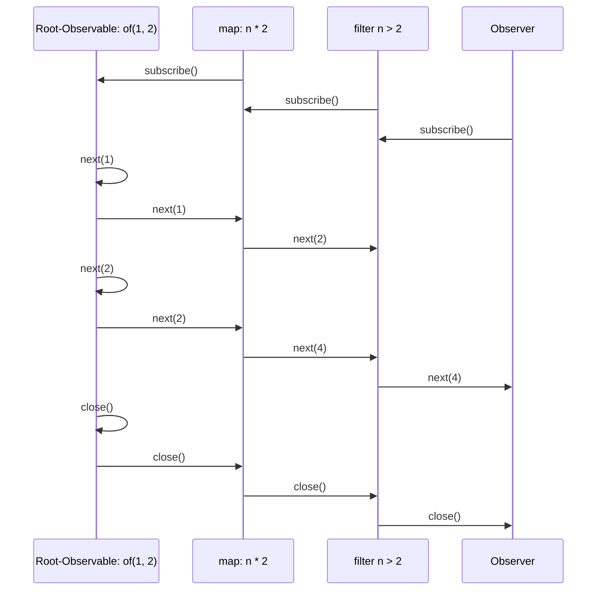

```mermaid
    sequenceDiagram
    participant p as Root-Observable: of(1, 2)
    participant s1 as map: n * 2
    participant s2 as filter n > 2
    participant s3 as Observer
    s1->>p: subscribe()
    s2->>s1: subscribe()
    s3->>s2: subscribe()
    p->>p: next(1)
    p->>s1: next(1)
    s1->>s2: next(2)
    p->>p: next(2)
    p->>s1: next(2)
    s1->>s2: next(4)
    s2->>s3: next(4)
    p->>p: close()
    p->>s1: close()
    s1->>s2: close()
    s2->>s3: close()
```