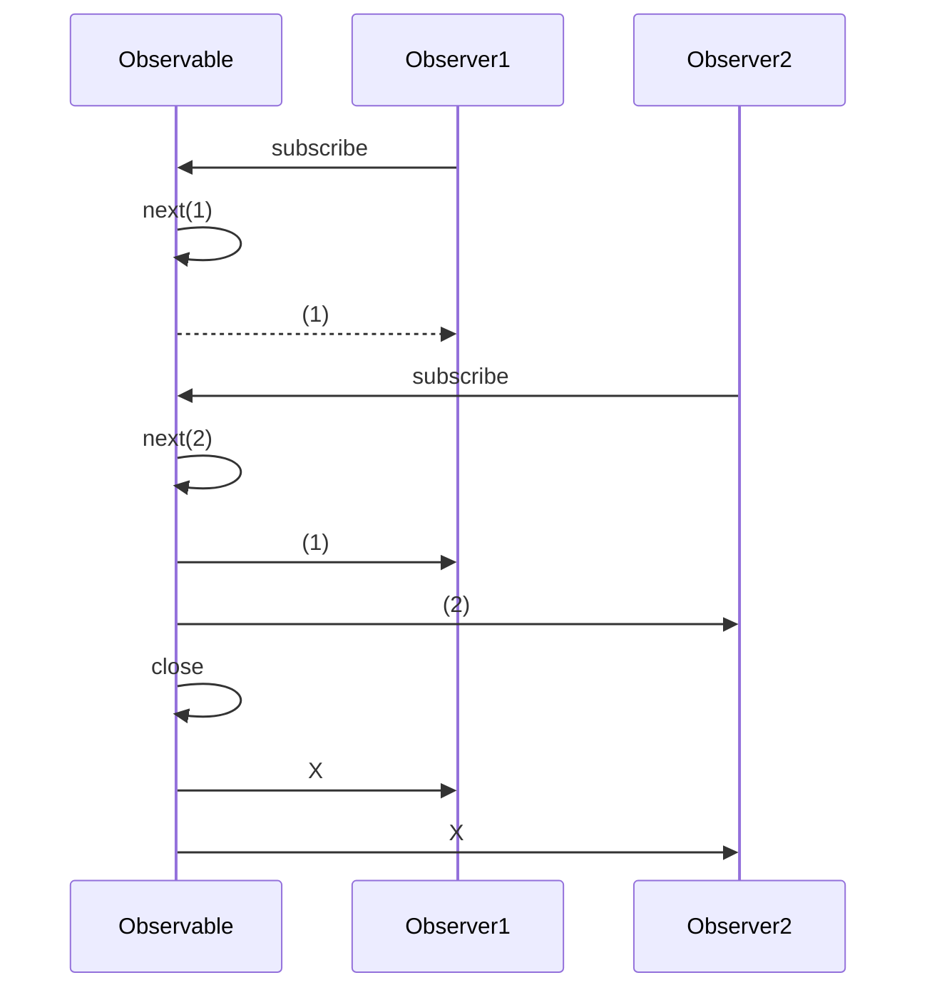

```mermaid
    sequenceDiagram
    participant p as Observable
    participant s1 as Observer1
    participant s2 as Observer2
    s1->>p: subscribe
    p->>p: next(1)
    p-->>s1: (1)
    s2->>p: subscribe
    p->>p: next(2)
    p->>s1: (1)
    p->>s2: (2)
    p->>p: close
    p->>s1: X
    p->>s2: X
```